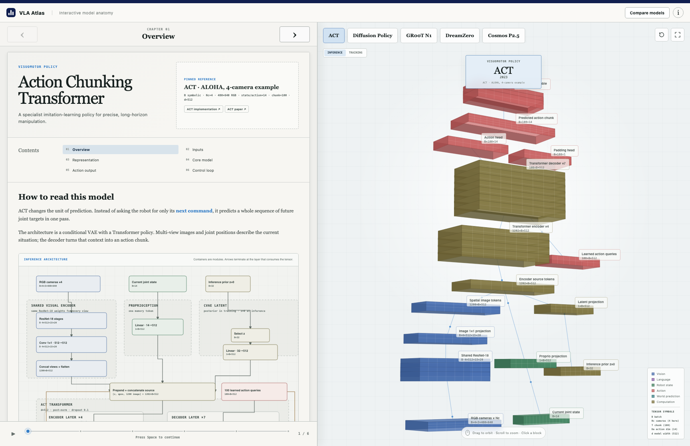

# VLA Atlas

An interactive, dependency-free architecture explorer for robot policies, vision-language-action models, World Action Models, and world foundation models.



The interface combines a guided lesson, checkpoint-pinned tensor shapes, inference/training pathway toggles, expandable layer inventories, and an original canvas-based exploded renderer. Selecting a chapter replaces generic module slabs with their internal operators, normalization, activation, input shape, and output shape.

## Run locally

From this directory:

```bash
python3 -m http.server 8000
```

Then open `http://localhost:8000`.

## Pinned reference configurations

- ACT: ALOHA-style 4-camera example, `d_model=512`, 4 encoder layers, 7 decoder layers, 100-step action chunks
- Diffusion Policy: published Push-T image CNN workspace, 1-D U-Net `[512, 1024, 2048]`
- NVIDIA GR00T N1-2B: Eagle width 1536 and 16-layer diffusion action expert
- DreamZero-DROID: released Wan2.1 I2V 14B World Action Model configuration with 32 causal blocks
- NVIDIA Cosmos Predict2.5-2B: 28-layer, width-2048 world diffusion Transformer

Tensor dimensions are tied to these named configurations. Robot-dependent widths remain explicitly symbolic (`Ds`, `Da`) instead of being guessed.

## Interaction

- Drag the model to orbit it.
- Scroll over the canvas to zoom.
- Click a block to inspect its role.
- Switch between **Inference** and **Training** to reveal posterior, target, and loss-only branches.
- Open a chapter's **Layer inventory** to inspect every layer without relying on dense canvas labels.
- Use the chapter arrows, timeline, or Space key to advance the walkthrough.
- Open **Compare models** for an aligned structural comparison.
- Use the expand button to focus on the visualization.

The diagrams use a shared visual ontology so models remain comparable while retaining their different scopes. Architecture facts link to primary implementation, checkpoint, and paper sources from inside the app.

## GitHub Pages

The included workflow publishes this static directory whenever `main` is updated. In repository settings, set **Pages → Build and deployment → Source** to **GitHub Actions**. Public-repository GitHub Pages hosting does not require a paid plan.
